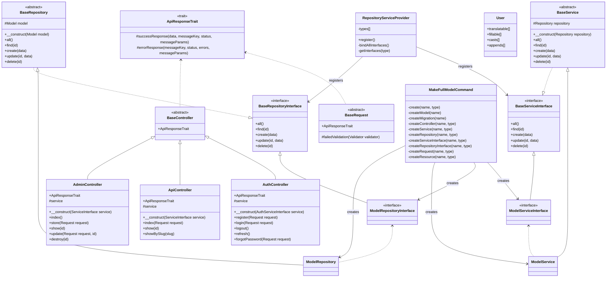

```mermaid
classDiagram
    %% Ana Sınıf Yapısı
    class BaseController {
        <<abstract>>
        +ApiResponseTrait
    }
    
    class BaseRepository {
        <<abstract>>
        #Model model
        +__construct(Model model)
        +all()
        +find(id)
        +create(data)
        +update(id, data)
        +delete(id)
    }
    
    class BaseService {
        <<abstract>>
        #Repository repository
        +__construct(Repository repository)
        +all()
        +find(id)
        +create(data)
        +update(id, data)
        +delete(id)
    }
    
    class BaseRequest {
        <<abstract>>
        +ApiResponseTrait
        #failedValidation(Validator validator)
    }
    
    %% Interface Yapısı
    class BaseRepositoryInterface {
        <<interface>>
        +all()
        +find(id)
        +create(data)
        +update(id, data)
        +delete(id)
    }
    
    class BaseServiceInterface {
        <<interface>>
        +all()
        +find(id)
        +create(data)
        +update(id, data)
        +delete(id)
    }
    
    class ModelRepositoryInterface {
        <<interface>>
    }
    
    class ModelServiceInterface {
        <<interface>>
    }
    
    %% Trait Yapısı
    class ApiResponseTrait {
        <<trait>>
        #successResponse(data, messageKey, status, messageParams)
        #errorResponse(messageKey, status, errors, messageParams)
    }
    
    %% Model Örneği
    class User {
        +translatable[]
        +fillable[]
        +casts[]
        +appends[]
    }
    
    %% Modül Örnekleri (Admin, API, Auth)
    class AdminController {
        +ApiResponseTrait
        #service
        +__construct(ServiceInterface service)
        +index()
        +store(Request request)
        +show(id)
        +update(Request request, id)
        +destroy(id)
    }
    
    class ApiController {
        +ApiResponseTrait
        #service
        +__construct(ServiceInterface service)
        +index(Request request)
        +show(id)
        +showBySlug(slug)
    }
    
    class AuthController {
        +ApiResponseTrait
        #service
        +__construct(AuthServiceInterface service)
        +register(Request request)
        +login(Request request)
        +logout()
        +refresh()
        +forgotPassword(Request request)
    }
    
    %% Service Provider
    class RepositoryServiceProvider {
        -types[]
        +register()
        -bindAllInterfaces()
        -getInterfaces(type)
    }
    
    %% Command
    class MakeFullModelCommand {
        -create(name, type)
        -createModel(name)
        -createMigration(name)
        -createController(name, type)
        -createService(name, type)
        -createRepository(name, type)
        -createServiceInterface(name, type)
        -createRepositoryInterface(name, type)
        -createRequest(name, type)
        -createResource(name, type)
    }
    
    %% İlişkiler
    BaseController <|-- AdminController
    BaseController <|-- ApiController
    BaseController <|-- AuthController
    
    BaseRepositoryInterface <|-- ModelRepositoryInterface
    BaseServiceInterface <|-- ModelServiceInterface
    
    BaseRepository ..|> BaseRepositoryInterface
    BaseService ..|> BaseServiceInterface
    
    ModelRepositoryInterface <.. ModelRepository
    ModelServiceInterface <.. ModelService
    
    BaseRepository <|-- ModelRepository
    BaseService <|-- ModelService
    
    ApiResponseTrait <.. BaseController
    ApiResponseTrait <.. BaseRequest
    
    RepositoryServiceProvider --> BaseRepositoryInterface : registers
    RepositoryServiceProvider --> BaseServiceInterface : registers
    
    MakeFullModelCommand --> ModelRepository : creates
    MakeFullModelCommand --> ModelService : creates
    MakeFullModelCommand --> ModelRepositoryInterface : creates
    MakeFullModelCommand --> ModelServiceInterface : creates
``` 