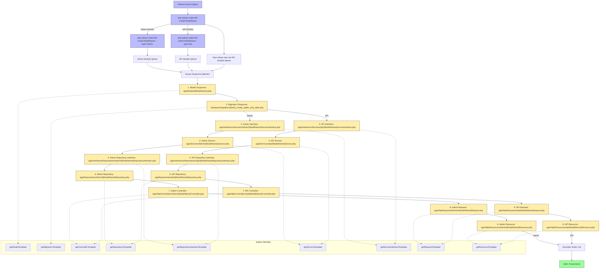

```mermaid
graph TD
    %% Make:Full-Model Komutu Akışı
    START[Artisan Komut Çağrısı] --> CMD[php artisan make:full-model ModelName]
    CMD -- Admin Modülü --> CMD_ADMIN[php artisan make:full-model ModelName --type=Admin]
    CMD -- API Modülü --> CMD_API[php artisan make:full-model ModelName --type=Api]
    
    CMD_ADMIN --> PROCESS_ADMIN[Admin Modülü İşleme]
    CMD_API --> PROCESS_API[API Modülü İşleme]
    CMD --> PROCESS_DEFAULT[Hem Admin hem de API Modülü İşleme]

    %% Ana İşlem Akışı
    PROCESS_ADMIN --> CREATE_FILES["Dosya Oluşturma İşlemleri"]
    PROCESS_API --> CREATE_FILES
    PROCESS_DEFAULT --> CREATE_FILES
    
    CREATE_FILES --> MODEL["1. Model Oluşturma: app/Models/{ModelName}.php"]
    MODEL --> MIGRATION["2. Migration Oluşturma: database/migrations/{tarih}_create_{tablo_adı}_table.php"]
    
    %% Type: Admin işlemleri
    MIGRATION -- Admin --> ADMIN_INTERFACE["3. Admin Interface: app/Interfaces/Services/Admin/{ModelName}ServiceInterface.php"]
    ADMIN_INTERFACE --> ADMIN_SERVICE["4. Admin Service: app/Services/Admin/{ModelName}Service.php"]
    ADMIN_SERVICE --> ADMIN_REPO_INTERFACE["5. Admin Repository Interface: app/Interfaces/Repositories/Admin/{ModelName}RepositoryInterface.php"]
    ADMIN_REPO_INTERFACE --> ADMIN_REPO["6. Admin Repository: app/Repositories/Admin/{ModelName}Repository.php"]
    ADMIN_REPO --> ADMIN_CONTROLLER["7. Admin Controller: app/Http/Controllers/Admin/{ModelName}Controller.php"]
    ADMIN_CONTROLLER --> ADMIN_REQUEST["8. Admin Request: app/Http/Requests/Admin/{ModelName}Request.php"]
    ADMIN_REQUEST --> ADMIN_RESOURCE["9. Admin Resource: app/Http/Resources/Admin/{ModelName}Resource.php"]
    
    %% Type: API işlemleri
    MIGRATION -- API --> API_INTERFACE["3. API Interface: app/Interfaces/Services/Api/{ModelName}ServiceInterface.php"]
    API_INTERFACE --> API_SERVICE["4. API Service: app/Services/Api/{ModelName}Service.php"]
    API_SERVICE --> API_REPO_INTERFACE["5. API Repository Interface: app/Interfaces/Repositories/Api/{ModelName}RepositoryInterface.php"]
    API_REPO_INTERFACE --> API_REPO["6. API Repository: app/Repositories/Api/{ModelName}Repository.php"]
    API_REPO --> API_CONTROLLER["7. API Controller: app/Http/Controllers/Api/{ModelName}Controller.php"]
    API_CONTROLLER --> API_REQUEST["8. API Request: app/Http/Requests/Api/{ModelName}Request.php"]
    API_REQUEST --> API_RESOURCE["9. API Resource: app/Http/Resources/Api/{ModelName}Resource.php"]
    
    %% Dosya Yazım İşlemi
    ADMIN_RESOURCE -- Admin --> SAVE_FILES["Dosyaları Diske Yaz"]
    API_RESOURCE -- API --> SAVE_FILES
    
    %% Şablon Metodları
    subgraph "Şablon Metotları"
        MODEL_TPL[getModelTemplate]
        MIGRATION_TPL[getMigrationTemplate]
        CONTROLLER_TPL[getControllerTemplate]
        REPO_TPL[getRepositoryTemplate]
        REPO_INTERFACE_TPL[getRepositoryInterfaceTemplate]
        SERVICE_TPL[getServiceTemplate]
        SERVICE_INTERFACE_TPL[getServiceInterfaceTemplate]
        REQUEST_TPL[getRequestTemplate]
        RESOURCE_TPL[getResourceTemplate]
    end
    
    %% Şablon Bağlantıları
    MODEL -.-> MODEL_TPL
    MIGRATION -.-> MIGRATION_TPL
    ADMIN_CONTROLLER -.-> CONTROLLER_TPL
    API_CONTROLLER -.-> CONTROLLER_TPL
    ADMIN_REPO -.-> REPO_TPL
    API_REPO -.-> REPO_TPL
    ADMIN_REPO_INTERFACE -.-> REPO_INTERFACE_TPL
    API_REPO_INTERFACE -.-> REPO_INTERFACE_TPL
    ADMIN_SERVICE -.-> SERVICE_TPL
    API_SERVICE -.-> SERVICE_TPL
    ADMIN_INTERFACE -.-> SERVICE_INTERFACE_TPL
    API_INTERFACE -.-> SERVICE_INTERFACE_TPL
    ADMIN_REQUEST -.-> REQUEST_TPL
    API_REQUEST -.-> REQUEST_TPL
    ADMIN_RESOURCE -.-> RESOURCE_TPL
    API_RESOURCE -.-> RESOURCE_TPL
    
    SAVE_FILES --> FINAL["İşlem Tamamlandı"]
    
    %% Stil
    classDef success fill:#9f9,stroke:#333,stroke-width:1px;
    classDef process fill:#bbf,stroke:#333,stroke-width:1px;
    classDef file fill:#fea,stroke:#333,stroke-width:1px;
    
    class START,CMD,CMD_ADMIN,CMD_API process;
    class MODEL,MIGRATION,ADMIN_INTERFACE,ADMIN_SERVICE,ADMIN_REPO_INTERFACE,ADMIN_REPO,ADMIN_CONTROLLER,ADMIN_REQUEST,ADMIN_RESOURCE,API_INTERFACE,API_SERVICE,API_REPO_INTERFACE,API_REPO,API_CONTROLLER,API_REQUEST,API_RESOURCE file;
    class FINAL success;
``` 