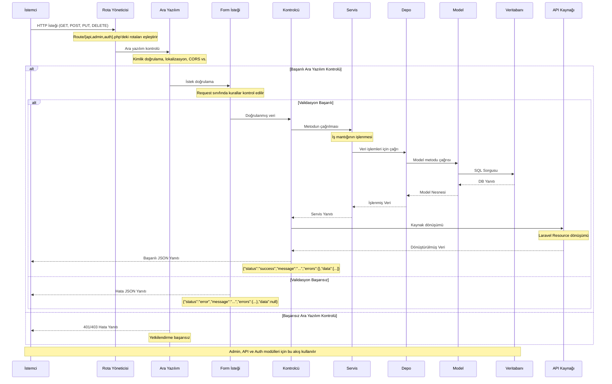

```mermaid
sequenceDiagram
    participant Client as İstemci
    participant Router as Rota Yöneticisi
    participant Middleware as Ara Yazılım
    participant Request as Form İsteği
    participant Controller as Kontrolcü
    participant Service as Servis
    participant Repository as Depo
    participant Model as Model
    participant DB as Veritabanı
    participant Resource as API Kaynağı
    
    Client->>Router: HTTP İsteği (GET, POST, PUT, DELETE)
    Note over Router: Route/{api,admin,auth}.php'deki rotaları eşleştirir
    
    Router->>Middleware: Ara yazılım kontrolü
    Note over Middleware: Kimlik doğrulama, lokalizasyon, CORS vs.
    
    alt Başarılı Ara Yazılım Kontrolü
        Middleware->>Request: İstek doğrulama
        Note over Request: Request sınıfında kurallar kontrol edilir
        
        alt Validasyon Başarılı
            Request->>Controller: Doğrulanmış veri
            Controller->>Service: Metodun çağrılması
            Note over Service: İş mantığının işlenmesi
            
            Service->>Repository: Veri işlemleri için çağrı
            Repository->>Model: Model metodu çağrısı
            Model->>DB: SQL Sorgusu
            DB-->>Model: DB Yanıtı
            Model-->>Repository: Model Nesnesi
            Repository-->>Service: İşlenmiş Veri
            
            Service-->>Controller: Servis Yanıtı
            
            Controller->>Resource: Kaynak dönüşümü
            Note over Resource: Laravel Resource dönüşümü
            
            Resource-->>Controller: Dönüştürülmüş Veri
            
            Controller-->>Client: Başarılı JSON Yanıtı
            Note over Controller: {"status":"success","message":"...","errors":{},"data":[...]}
        else Validasyon Başarısız
            Request-->>Client: Hata JSON Yanıtı
            Note over Request: {"status":"error","message":"...","errors":{...},"data":null}
        end
    else Başarısız Ara Yazılım Kontrolü
        Middleware-->>Client: 401/403 Hata Yanıtı
        Note over Middleware: Yetkilendirme başarısız
    end
    
    Note over Client,DB: Admin, API ve Auth modülleri için bu akış kullanılır
``` 